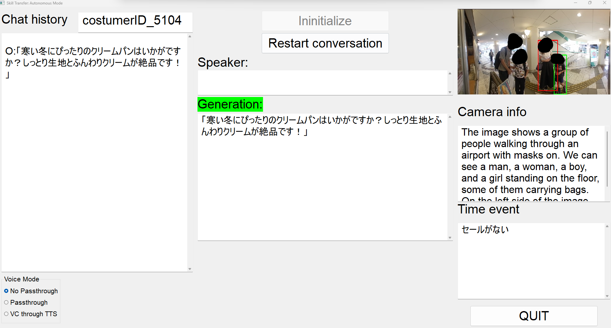

# Introduction

This is a GUI program that allows for reproducing a specific conversational skill based on an expert's data (this respository contains the example of costumer attracting skill).

It is modularly build to allow for indepent upgrades to its different subsystems.

You can input the time events (ex: sale information) manually into the Time event field.

In the autonomous mode, the program will decide when to speak automatically. It will take into account the information from the camera, including facial recognition and costumer clothing to switch costumer profiles appropriately in real time.

The program also allows you to speak to the costumers directly with your own voice (passthrough), or by using a voice changer based on TTS or RVC.



The picture above is from the program running in autonomous mode. There is also a suggestion mode that gives you 3 suggestions to choose by pushing buttons.

This program was tested on windows 11 (10.0.22631.4751) , python 3.11.11, cuda 12.4.

# Prerequisites

## pip

Install the required libraries:

```
pip install -i requirements.txt
```

For better performance, I recommend compiling OpenCV from source with cuda.

## Edge driver

This is used along with `selenium` to get around the browser's `webkitSpeechRecognition` 's inability to listen to more than one microphone at a time.

Download the edge driver from [Microsoft Edge WebDriver | Microsoft Edge Developer](https://developer.microsoft.com/en-us/microsoft-edge/tools/webdriver/?cs=163218577&form=MA13LH#downloads) and unzip `msedgedriver.exe` to `utils/html/` .

## VB audio virtual cable

Download and install VB audio virtual cable AND VB audio virtual cable A+B from [VB-Audio Virtual Apps](https://vb-audio.com/Cable/) .

## Download the different local models

Download the following models and place them inside `model_assets` :

* [deepfashion2_yolov8s-seg.pt · Bingsu/adetailer at main](https://huggingface.co/Bingsu/adetailer/blob/main/deepfashion2_yolov8s-seg.pt)
* [litagin/style_bert_vits2_jvnv at main](https://huggingface.co/litagin/style_bert_vits2_jvnv/tree/main/jvnv-F1-jp) folder and its contents
* [rmvpe.pt · lj1995/VoiceConversionWebUI at main](https://huggingface.co/lj1995/VoiceConversionWebUI/blob/main/rmvpe.pt)
* [yolo11s . ultralytics](https://github.com/ultralytics/assets/releases/download/v8.3.0/yolo11s.pt)
* [hubert_base.pt · lj1995/VoiceConversionWebUI at main](https://huggingface.co/lj1995/VoiceConversionWebUI/blob/main/hubert_base.pt)
* Copy `assets\weights\kikiV1.pth` file from [RVC1006Nvidia.7z · lj1995/VoiceConversionWebUI at main](https://huggingface.co/lj1995/VoiceConversionWebUI/blob/main/RVC1006Nvidia.7z)

# Usage

## Main program

There are two methods to run the code.

1. Using the ArgumentParser

```
python main.py --profile_change 0 --profile_folder 'histories/'
```

2. Using the class object directly in python

```
convo = Conversation_class(profile_change=False, profile_folder='histories/')
```

For the full list of possible arguments and usage, please refer to `main.py` under the `# First method` comment for each parameters explanation.

## Skill extraction program

This repository already comes with expert data included.

If you want to provide your own expert data for a different conversational skill, change the `RESOURCE_FILES` paths in the  `extract_data_step_1.py `and `extract_data_step_2.py` to your own expert videos. Then, run the `extract_data_...` and `extract_skill.py` programs again.

# 3rd party licence and copyright

Please refer to `3rdparty/` for more information about all the licences of the different open source softwares used to build this program.

If you feel like your module/library/code has been used without proper license or creditation please raise an issue or a pull request and I will make sure to include the changes required.
